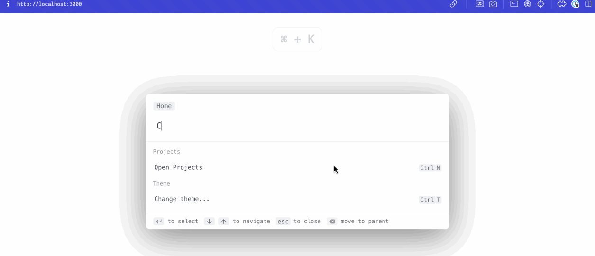

# palette-keys

LWC Command Palette component



## Getting Started

To run the project locally, you can use the following command:

```bash
git clone git@github.com:KanesAccount/palette-keys.git
cd palette-keys/demo/palette-keys-lwr
yarn build
yarn start
```

Once the processes have finished, open the site at http://localhost:3000


### Usage

Add the tag to your HTML, and set `action_data`.

```html
<palette-keys data-id="PaletteKeys" action_data={action_data}></palette-keys>
```

```html
<script>
this.action_data = [
	{
		id: 'Projects',
		title: 'Open Projects',
		hotkey: 'ctrl+N',
		icon: 'apps',
		section: 'Projects',
		handler: () => {
			// auto registered the above hotkey with this handler
			alert('Your logic to handle');
		},
	},
	{
		id: 'theme',
		title: 'Change theme...',
		icon: 'desktop_windows',
		section: 'Theme',
		children: [
			{
				id: 'light_mode',
				title: 'Light Mode',
				parent: 'Theme',
				handler: () => {
					let palette = this.template.querySelector('[data-id="PaletteKeys"]');
					palette.classList.remove('dark');
					return {keepOpen: true};
				},
			},
			{
				id: 'dark_mode',
				title: 'Dark Mode',
				parent: 'Theme',
				handler: () => {
					let palette = this.template.querySelector('[data-id="PaletteKeys"]');
					palette.classList.add('dark');
					return {keepOpen: true};
				},
			},
		],
		hotkey: 'ctrl+T',
		handler: () => {
			// open menu if closed. Because you can open directly that menu from it's hotkey
			let palette = this.template.querySelector('[data-id="PaletteKeys"]');
			palette.open({ parent: 'Theme' });
			// if menu opened that prevent it from closing on select that action, no need if you don't have child actions
			return {keepOpen: true};
		},
	},
	{
		id: 'default',
		title: 'Default Action',
		default: true,
		handler: () => {
			alert('Your default logic to handle');	
			let palette = this.template.querySelector('[data-id="PaletteKeys"]');
			palette.resetDefault();
		}
	}
];
</script>
```
## Attributes
| Field                | Default                     | Description                                                 |
|----------------------|-----------------------------|-------------------------------------------------------------|
| placeholder          | Type a command or search... | Placeholder for search                                      |
| disableHotkeys       | false                       | If attribute exist will register all hotkey for all actions |
| hideBreadcrumbs      | false                       | Hide breadcrumbs on header if true                          |
| openHotkey           | cmd+k,ctrl+k                | Open or close shortcut                                      |
| navigationUpHotkey   | up,shift+tab                | Navigation up shortcuts                                     |
| navigationDownHotkey | down,tab                    | Navigation down shortcuts                                   |
| closeHotkey          | esc                         | Close shortcut                                              |
| goBackHotkey         | backspace                   | Go back on one level if has parent menu                     |
| selectHotkey         | enter                       | Select action and execute handler or open submenu           |
| hotKeysJoinedView    | false                       | If exist/true will display hotkeys inside one element       |
| noAutoLoadMdIcons    | false                       | If exist it disable load material icons font on connect     |

#### Example
```html
<palette-keys data-id="PaletteKeys" action_data={action_data} placeholder="Must not touch mouse" openHotkey="cmd+l" hideBreadcrumbs></palette-keys>
```

## Data
Array of `action_data` - interface properties below
| Name     | Type                    | Description                                                                            |
|----------|-------------------------|----------------------------------------------------------------------------------------|
| id       | string                  | Unique id/text. Will be displayed as breadcrumb in multimenu                           |
| title    | string                  | Title of action                                                                        |
| hotkey   | string(optional)        | Shortcut to display and register                                                       |
| handler  | Function(optional)      | Function to execute on select                                                          |
| icon     | string(optional)        | Html to render as custom icon (TODO)                                                   |
| parent   | string(optional)        | If using flat structure use id of actions to make a multilevel menu                    |
| keywords | string(optional)        | Keywords to use for search                                                             |
| children | Array<string>(optional) | If using flat structure then ids of child menu actions. Not required on tree structure |
| section  | string(optional)        | Section text. Like a header will be group with other same sections                     |

## Methods
| Name      | Arg                 | Description                                         |
|-----------|---------------------|-----------------------------------------------------|
| `open`      | { parent?: string } | Open menu with parent, if null then open root menu  |
| `close`     |                     | Close menu                                          |
| `setParent` | parent?: string     | Navigate to parent menu                             |

#### Example
```js
let palette = this.template.querySelector('[data-id="PaletteKeys"]');
palette.open();
// or
palette.open({ parent: 'Theme' });
```

### Events
Component wide events

| Name                               | Description                         | Payload |
|------------------------------------|-------------------------------------| ------- |
| `change`                           | Emitted when on each change of search input | `{ detail: { search: string, actions: [action_data] } }` |
| `selected`                         | Emitted when on user selected action or on submit of input | `{ detail: { search: string, action: action or undefined }}` |

Both `handler` of action and component event `selected` emitted when user submit form or select item.

But event `selected` can be used to handle edge cases, so it's not recommended to write each action logic here. It’s better to use the action `handler` property.

For example, if a user enters a search query and there is an empty list, listening to this event you can handle that.

```js
palette.addEventListener('change', (event) => {
  console.log('palette on change', event.detail);
  // detail = {search: 'your search query', actions: [action_data]}
})
palette.addEventListener('selected', (event) => {
  console.log('palette on selected', event.detail);
  // detail = {search: 'your search query', action: action | undefined }
  if (event.detail.action){
	// perform API search for example
  }
})
```

## Themes
Component supports a dark theme out-of-box. You just need to add a class.
```html
<palette-keys class="dark" data-id="PaletteKeys" action_data={action_data}></palette-keys>
```

If you need more style control, use any of the CSS variables below.
### CSS variables
| Name                               | Default                            |
|------------------------------------|------------------------------------|
| --palette-width                    | 640px;                             |
| --palette-backdrop-filter          | none;                              |
| --palette-overflow-background      | rgba(255, 255, 255, 0.5);          |
| --palette-text-color               |  rgb(60, 65, 73);                  |
| --palette-font-size                | 16px;                              |
| --palette-top                      | 20%;                               |
| --palette-key-border-radius        | 0.25em                             |
| --palette-accent-color             | rgb(110, 94, 210);                 |
| --palette-secondary-background-color | rgb(239, 241, 244);              |
| --palette-secondary-text-color     |  rgb(107, 111, 118);               |
| --palette-selected-background      | rgb(248, 249, 251);                |
| --palette-icon-color               | var(--palette-secondary-text-color); |
| --palette-icon-size                | 1.2em;                             |
| --palette-separate-border          | 1px solid var(--palette-secondary-background-color); |
| --palette-modal-background         | #fff;                              |
| --palette-modal-shadow             | rgb(0 0 0 / 50%) 0px 16px 70px;    |
| --palette-actions-height           | 300px;                             |
| --palette-group-text-color         |  rgb(144, 149, 157);               |
| --palette-footer-background        | rgba(242, 242, 242, 0.4);          |
| --palette-placeholder-color        | #8e8e8e                            |
| --palette-z-index                  | 1                                  |

#### Example
```css
palette-keys {
  --palette-width: 400px;
}
```

### CSS Shadow Parts
Allowing you to style specific elements from your style.
Because styles are encapsulated by Shadow DOM, it will be annoying to create css variables for all properties.
That's why you can use `::part` to make a custom look for the component.
It's supported by [all modern browsers](https://caniuse.com/mdn-css_selectors_part)

| Name                               | Description                            |
|------------------------------------|----------------------------------------|
| actions-list                       | Element that wraps all child elements. |
| palette-action                     | Single action                          |
| palette-selected                   | Selected action                        |
| palette-input                      | Input element                          |
| palette-input-wrapper              | Wrapper element around div             |

#### Example style using parts
```css
palette-keys::part(actions-list) {
  padding: 8px;
}
palette-keys::part(palette-action) {
  border-radius: 8px;
  border-left: none;
}

palette-keys::part(palette-selected) {
  background: rgba(51, 51, 51, 0.1);
}


palette-keys::part(palette-input) {
  color: #14b8a6;
}

palette-keys::part(palette-input)::placeholder {
  color: #f43f5e;
}

palette-keys::part(palette-input-wrapper) {
  background: rgba(244, 63, 93, 0.3);
}
```

### Icons (WIP)

If you want custom icons, you can use `svg` or `img` to insert it with an `icon` property for action with `palette-icon` class.
Example:
```js
{
  title: 'Search projects...',
  icon: `<svg xmlns="http://www.w3.org/2000/svg" class="palette-icon" fill="none" viewBox="0 0 24 24" stroke="currentColor">
    <path stroke-linecap="round" stroke-linejoin="round" stroke-width="2" d="M7 8h10M7 12h4m1 8l-4-4H5a2 2 0 01-2-2V6a2 2 0 012-2h14a2 2 0 012 2v8a2 2 0 01-2 2h-3l-4 4z" />
  </svg>`,
  section: 'Projects',
},
```
You can also change the width and font using CSS variables
```css
palette-keys {
  --palette-icon-size: 1em;
}
```


### Change or hide footer
```html
<palette-keys data-id="PaletteKeys" action_data={action_data}> 
  <div slot="footer">You can use a custom footer or empty div to hide it</div>
</palette-keys>
```


## Dev Server

```bash
yarn build --watch
yarn start
```

## Formatting

[Prettier](https://prettier.io/) is used for code formatting. It has been pre-configured according to the Lit's style.

## License

Licensed under [the MIT license](./LICENSE).

